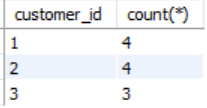
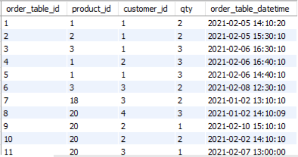

# SQL Aggregate Functions (Murach Chapter 6 Summary Queries)

An aggregate function is a computation where the values of multiple rows are grouped together as input on certain criteria to form a single value of significant meaning.


## Learning Objectives
The idea is that you after working with these exercises:

- are able to code summary queries using the aggregate functions: AVG, SUM, MIN, MAX, COUNT, COUNT(*)
- are able to code summary queries with HAVING and GROUP BY
- can maintain an SQL script to handle database changes


## Relevance for your professional life
Pretty much all systems need to persist data and relational databases are the most widely used for (administrative) systems. You will need SQL as a query language to get data out of the database.

##  Supplementary resources
  - [w3schools tutorials: ](https://www.w3schools.com/sql/default.asp) Min, Max, Avg, Count, Sum
- [LinkedIn Learning video](https://www.linkedin.com/learning/sql-essential-training-3/what-are-aggregates?u=36836804) SQL Essential Training: chapter 8


## Why aggregate functions?
Sometimes we don't "just" want to retrive the actual rows from the database, but rather need information based on aggregated data. For instance:
* Who earns the most in the company?
* What is the total sum of salaries in the development department?
* What is the average salary based on gender?

SQL aggregate functions can give of these summary queries. There are five functions: 

### `count()`

* count(*): counts total number of rows.
* count(salary): counts number of not null values for the column, e.g. salary.
* count(distinct salary):  counts number of distinct non null values for the column, e.g. salary.

### `sum()`

* sum(salary):  sums all not null values for column, e.g. salary.
* sum(distinct salary): sums all distinct non null values for the column,e.g. salary.

### `avg()`

* avg(salary) = sum(salary) / count(salary).
* avg(distinct salary) = sum (distinct salary) / count(distinct salary).

 
### `min()` & `max()`

* min(salary): finds minimum value among the the not null values for the column, e.g. salary.
* max(salary): finds maximum value among the the not null values for the column, e.g. salary.

# Examples (together) 

Let’s use this table ‘orders’:


### Stated in natural language, what do the following SQL statements express (the result is shown below the SQL statement)?

A)
```sql
select count(*) from orders;
```


B)
```sql
select count(distinct customer_id) from orders;
```


C)
```sql
select min(order_date) from orders;
```


# Exercises (45 minutes)

We will use the coffee-database (the database you used in Benjamin’s classes). If you don’t have the database already, find the script to create the database [here.](https://github.com/behu-kea/dat20-classes/blob/master/week-11/assets/coffee-database.sql)


1.	Find the number of female customers.

```sql
select count(*) from customer
where gender = 'F';
```
2.	Find the number of customers whose last name starts with ‘B’.

```sql
select count(*) from customer
where lastname like 'B%';
```

3.	Calculate the average price of all products (only output the average price, no other information).

```sql
select avg(price) from product;
select round(avg(price)) from product;
```
4.	List product id, country and price for all products (no aggregate function, but a join of product and country tables is needed).

```sql
select product_id, country, price from product inner join country on product.country_id = country.country_id;
```

5. Calculate the total sum of all orders.

```sql
SELECT SUM(price * qty) AS 'TOTAL SUM OF ORDERS'
FROM order_table
INNER JOIN product ON product.product_id = order_table.product_id;
```


### Group by and having

You can aggregate data grouped by some criteria using `GROUP BY`: <br>
In this example we are counting the number of orders for each customer (i.e grouped by customer_id):

```sql
select customer_id, count(*) from orders
group by orders.customer_id;
```


You can limit the result, combining `GROUP BY` and `HAVING`. `HAVING` determines which groups are included in the final result. <br>
In this example we are counting the number of orders for each customer (i.e grouped by customer_id), BUT only for customers that have more than 2 orders:

```sql
select customer_id, count(*) from orders
group by orders.customer_id
having count(*) > 2;
```



<br>
<br>
Use `GROUP BY` and `HAVING`in the following exercises.
 <br>
<br>


1. List number of customers of each gender.
```sql
select count(*) from customer
group by gender;
```

2. List number of customers of each gender, BUT only if there are more than 10 employees of the gender.

```sql
select count(*) from customer
group by gender having count(gender) > 10;
```


1.	List the average price (and no other information) for products for each country.
```sql
select avg(price) from product
group by country_id;
```

2.	List product id, country name and average product price for each country (you will need to join product and country tables).

```sql
select product_id, country, avg(price) from product inner join country on product.country_id = country.country_id
group by country.country_id;
```

3. List product id, country name and average product price for each country, but only for countries that have an average product price higher than 20.00. 

```sql
select product_id, country, avg(price) from product inner join country on product.country_id = country.country_id
group by country.country_id having avg(price) > 20.0;
```

# SQL Script exercise (Home exercise - ~ 45-60 minutes)


Something about the current coffee database design doesn’t quite seem right. <br>
Can you find any problems and possible improvements?





```
Redesign the database:
1.	Update SQL script
2.	Make sure that the primary keys can be create automatically (hint: `AUTO_INCREMENT`)
3.	Run SQL script 
```
**Voila you now have a redesigned database, ready to be shared with the rest of your team!**


