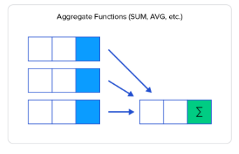
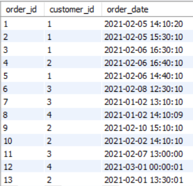
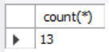
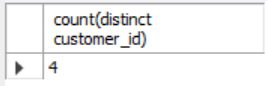
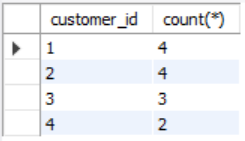
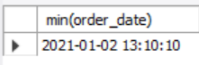

# SQL Aggregate functions (Murach Chapter 6 Summary Queries)

An aggregate function is a computation where the values of multiple rows are grouped together as input on certain criteria to form a single value of more significant meaning.



## Learning Objectives
The idea is that you after working with these exercises:

- is able to code summary queries using the aggregate functions: AVG, SUM, MIN, MAX, COUNT, COUNT(*)
- is able to code summary queries with HAVING and GROUP BY
- can maintain an SQL script to handle database changes
- AUTO_INCREMENT


## Relevance for your professional life
Pretty much all systems need to persist data and relational databases are the most widely used for (administrative) systems. You will need SQL as a query language to get data out of the database.

##  Supplementary resources
  - [w3schools tutorials: ](https://www.w3schools.com/sql/default.asp) Min, Max, Avg, Count, Sum
- [LinkedIn Learning video](https://www.linkedin.com/learning/sql-essential-training-3/what-are-aggregates?u=36836804) SQL Essential Training: chapter 8


## Why aggregate functions?
Sometimes we don't "just" want to retrive the actual rows from the database, but rather need information based on aggregated data. For instance:
* Who earns the most in the company?
* What is the total sum of salaries in the development department?
* What is the average salary based on gender?

SQL aggregate functions can give of these summary queries. There are five functions: 

### count():

* count(*): counts total number of rows.
* count(salary): counts number of not null values for the column, e.g. salary.
* count(distinct salary):  counts number of distinct non null values for the column, e.g. salary.

### sum():

* sum(salary):  sums all not null values for column, e.g. salary.
* sum(distinct salary): sums all distinct non null values for the column,e.g. salary.

### avg():

* avg(salary) = sum(salary) / count(salary).
* avg(distinct salary) = sum (distinct salary) / count(distinct salary).

 
### min() & max():

Min(salary): finds minimum value among the the not null values for the column, e.g. salary.
Max(salary): finds maximum value among the the not null values for the column, e.g. salary.

# Examples (together) 

Let’s use this table ‘orders’:



### If stated in natural language, what do the following SQL statements express (the result is shown below the SQL statement)?

A)
select count(*) from orders;



B)
select count(distinct customer_id) from orders;



C)
select min(order_date) from orders;




## Git begreber


### Group by having

D)
select customer_id, count(*) from orders
group by orders.customer_id;



Workspace (arbejdsområde) er de filer, der er i din normale filstruktur. Tænk på et IntelliJ projekt som et eksempel.

### Snapshot
Et snapshot er en kopi af dit workspace, som man kan vende tilbage til (vende tilbage til betyder at det er nemt at kopiere et snapshot tilbage i workspace).

### Repository 
Repository (lager) er, hvor git lægger snapshots af workspace til side, så man kan vende tilbage til det, hvis der bliver behov for det. I praksis arbejder man med to repositories i git:

* Et *lokalt repository*, som er på din egen maskine. Det tillader, at du kan lave nye snapshots selv. Det lokale repository er i et katalog der hedder ".git" i roden af dit IntelliJ projekt.
* Et *delt repository*, som ligger på en server, som alle i teamet kan tilgå.

#### Staging area (også kaldet "index")
Dette er et specielt snapshot, som git holder styr på, men som endnu ikke er lagt i repository (staging area kan vel her oversættes til "byggepladsen"). Avancerede brugere kan lave alle mulige sjove ting med det. Vi kommer blot til at bruge det som mellemled mellem workspace og lokalt repository.

### Git kommandoer
Der er nogle få kommandoer vi kommer til at bruge fra git-bash:

`git status` 

* denne kommando fortæller dig:

  * hvilke filer, der er nye i workspace (i forhold til staginging area)
  * hvilke filer, der er ændret i workspace (i forhold til staginging area)
  * hvilke filer, der er nye/ændrede i staging area sammeholdt med seneste snapshot i lokal repository
  * forholdet mellem dit lokale repository og det delte repository

`git add .` 

* tilføjer alle ændringer i workspace til staging area.

`git commit -m" beskrivelse"` 

* lægger snapshot fra staging area over i lokal repository. Beskrivelsen skal kort sige, hvad du ændrede i denne version.

`git log`

* giver en liste over de snapshots, der er i repository. 

`git clone URL`

* bruges til at lave en lokal kopi af et delt repository. Dette er langt den nemmeste måde at starte et lokalt repository.

`git push`

* opdaterer det delte repository til også at inkludere de snapshots, du har i dit lokale repository

`git pull`

* opdaterer dit lokale repository til også at have de snapshots, der er i det delte repository

Dette er en oversigt over de mest brugte kommandoer i git. Og vi vil næppe bruge ret mange af dem.


## Opsætning

Der er flere måder at gøre det på, men det *nemmeste* er at starte på github. 

### Lav et nyt projekt på github
1. Du skal oprette en konto på github
2. Dernæst skal du oprette et nyt repository (det er det lille "+" i øverste højre hjørne)
3. Du vil blive spurgt om navn på repository - tænk på dette navn som det samme navn du ville bruge til et IntelliJ projekt
4. LAV README FILEN!!!!

Du skulle nu gerne se noget der minder om dette:


### Gitignore
Dette er en lille knast, vi skal over. Når vi siger `git add .` så vil git lægge alle nye eller ændrede filer i workspace over i staging area. Men der er mange ting der *ikke* skal med. F.eks.

* Filer der er specifikke til Mac (ikoner mv)
* Filer der er specifikke til Windows (ikoner mv)
* Filer der indeholder personlige indstillinger for netbeans
* Filer der er oversatte java programmer

For at gøre dette til at holde ud i praksis, så kan man lave en speciel fil der hedder `.gitignore` som placeres øverst i projektet. 

1. Download denne [.gitignore](sample_gitignore.txt) fil. (som er en, jeg har lavet)
2. På det nye projekt i github, vælg den knap der hedder "Create new file" (lidt til venstre for den store grønne knap).
3. Dette åbner et vindue hvor du kan  paste indholdet fra den downloadede `.gitignore` fil ind, og du kan navngive filen ".gitignore". - Github opdager du er ved at lave en gitignore fil, men den hjælp den giver er ikke god nok!.
4. skriv en kort besked i "commit changes" (f.eks. *tilføjede .gitignore fil*)

### Clone repository
Hvis du trykker på den store grønne knap, kommer der en mulighed frem hvor du kan vælge "copy url til clipboard":


### Så skal du over i Git Bash....

Download https://git-scm.com/downloads og installér (følg default settings i installationsprocessen medmindre du har særlige præferencer).

### Kom i gang
Jeg vil anbefale at du laver et katalog i dit filsystem, som du bruger til git-projekter. Flyt dig derhen vha. `cd` kommandoen.

I kommando prompten skal du så skrive `git clone URL`, hvor URL er det du kopiere de fra github.

git clone kommandoen skulle så gerne skrive noget i stil med:

```
$ git clone https://github.com/kaspercphbusiness/test100.git
Cloning into 'test100'...
remote: Counting objects: 7, done.
remote: Compressing objects: 100% (5/5), done.
remote: Total 7 (delta 1), reused 0 (delta 0), pack-reused 0
Unpacking objects: 100% (7/7), done.
$
```


**Tillykke, du har nu dit første lokale git repository!**


#### Kopier filer ind i workspace
Du har sikkert allerede et IntelliJ projekt. Du kan nu kopiere filerne ind i det nyt git projekt og bruge `git log` og `git status` til at se, hvad der er sket ind til videre.

Der findes andre metoder til at sætte det op. Det er muligt at starte med at lave et lokalt repository, og så senere sætte det på som delt repository. Men metoden ovenfor virker.


# Opgave
Opgaven er at få sat et repository op for jeres Grocery List opgave (Java repetitionsopgave). 

Der er dog først lige nogle øvelser, der ikke handler om denne opgave.


### Opg 1
Der skal oprettes et repository på github, som I skal være to om. 

* Som led i at oprette dette repository vil jeg anbefale at I i readme filen skriver, hvilke medlemmer der er med i gruppen, og hvad jeres github brugernavne er.
* Husk at få lavet .gitignore filen - se ovenfor.
<!--- * Inviter dine gruppemedlemmer til at være med i dette repository. --->


### Opg 2
Download (ikke vha clone, blot ren gammeldags zip) [Kodestafet zipfil på Fronter](https://kea-fronter.itslearning.com/LearningToolElement/ViewLearningToolElement.aspx?LearningToolElementId=847847)  og få det til at køre. 

### Opg 3
Lave en klon af github projektet og kopierer IntelliJ projektet over i denne klon og få det op på github.

### Opg 4
Klon til den andens maskine og få det også til at køre fra dennes maskiner (I har nu to kloner kørende lokalt).

### Opg 5
Den ene af jer ændrer datoformatet i udskrivDato metoden() i klassen Hovedmenu.java så man får udskrevet dato med punktum i stedet for bindestreg. F.eks. 31.08.2020.

### Opg 6
Den, der ændrede, skal nu få disse ændringer på github. Det gøres ved:

```bash
$ git add . # Tilføj alle ændringer fra workspace til staging/index.
$ git commit -m "Ændret datoformat"
$ git push # Push ændringer til github
```
### Opg 7
Den anden skal nu få denne ændring ned på sin egen maskine

```bash
$ git pull # opdater local repository og workspace
```

### Opg 8
Slet det directory som indeholder projektet. Check at det er fuldstændigt væk, dødt, pist borte! Dernæst gå til jeres Github og klon det, så du får det igen. Pointe: Hvis det er på jeres github er det aldrig tabt!!!!

## Merge opgave (extra)
Denne opgave er optionel - men skal laves af alle på et tidpunkt senere i semesteret.

### Opg 9 
Når man skal arbejde sammen, så er der mange ting der skal falde på plads,  her vil vi se på to ting:

* Man prøver at aftale hvem der arbejder på hvilke filer (f.eks. en laver database og en anden laver web sider ...)
* Det er vigtigt at man ofte laver et `git pull` så man holder sit workspace opdateret i forhold til hvad de andre i gruppen har lavet.

Men det sker at der opstår "merge konflikter". Det sker hvis du har været inde i fil X og rettet i linje 18, samtidigt med at der er en anden der har gjort det samme. Hvis den anden har sagt `git push` før dig, så vil du få en række fejl når du siger `git push`:

* Først vil du få at vide at du skal sige pull, da du er "bagud" i forhold til github.
* Når du så siger pull, vil du få en meget lang fejlbeskrivelse. Den siger, at git ikke selv kunne finde ud af at sætte de to ændringer sammen (der er rettet det samme steder i de samme filer).

1. Få dette til at ske - den ene af jer laver en ny ændring i datoformat i udskrivDato() metoden og pusher denne rettelse til github.
2. Den anden laver også ændring i udskrivDato() metodens datoformat, men til noget andet forstås! Og prøver derefter et `git push` (efter `git add` og `git commit`).
3. Dette bør give fejl. Så skrives `git pull`.
4. Dette giver en fejlmeddelse i stil med denne:


Åbn projektet i IntelliJ for at få vist merge konflikter. Klik på linket "Resolve":


Du er ansvarlig (over for gruppen) for at få rettet dette til noget, der er OK. Det kan betyde du skal på github for at se hvem der har lavet den anden del, snakke med vedkommende, og så blive enige om hvad der skal gøres. Men det er dig, der skal rette det!

Når du igen har noget kode der virker (måske er der dele fra begge to, der skal bruges) så kan du lave:

`git add .` 

`git commit -m "Rettet merge konflikt"` og 

`git push`.

Du har nu håndteret din første merge konflikt.

